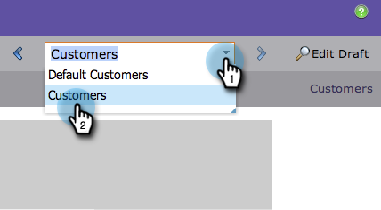

# Visualizar uma página de aterrissagem com conteúdo dinâmico {#preview-a-landing-page-with-dynamic-content}

Visualize sua página de aterrissagem depois de adicionar conteúdo dinâmico para garantir que tudo fique como deveria.

>[!PREREQUISITES]
>
>* [Usar conteúdo dinâmico em uma página de aterrissagem](/help/marketo/product-docs/demand-generation/landing-pages/personalizing-landing-pages/use-dynamic-content-in-a-landing-page.md)
>* [Visualizar uma página de aterrissagem](/help/marketo/product-docs/demand-generation/landing-pages/landing-page-actions/preview-a-landing-page.md)

1. Selecione uma página de aterrissagem e clique em **Página Visualizar**.

   

1. Clique no menu suspenso e selecione uma **Segmento** para pré-visualizá-lo.

   

Ótimo! Agora é possível garantir que suas landing pages funcionem para que você deseje em todos os segmentos.
