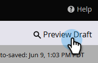

# Pré-visualizar uma página de destino {#preview-a-landing-page}

Visualize sua landing page para ver sua aparência antes de ativá-la.

>[!IMPORTANT]
>
>Algumas metatags personalizadas não têm suporte no modo de visualização (como a diretiva de redirecionamento `<meta http-equiv="refresh" ...>`), pois podem violar a Política de Segurança de Conteúdo estabelecida para manter a Marketo Engage segura. É possível visualizar as páginas de aterrissagem com essas marcas gerando a URL de visualização (**Ações de visualização** > **Gerar URL de Visualização**) e colando-a em uma nova janela do navegador.

## Pré-visualizar uma página aprovada {#preview-approved-page}

1. Selecione a página de aterrissagem desejada e clique em **[!UICONTROL Visualizar]**.

   

Você também pode clicar com o botão direito do mouse na sua página de aterrissagem e selecionar **[!UICONTROL Visualizar]**.

## Visualizar um rascunho {#preview-a-draft}

1. Selecione a página de aterrissagem desejada e clique em **[!UICONTROL Visualizar rascunho]**.

   

>[!NOTE]
>
>O rascunho é a versão em que você está trabalhando, não a versão em tempo real que os clientes veem.

## Visualizar um rascunho de página de aterrissagem ao editar {#preview-a-draft-while-editing}

1. Selecione a página de aterrissagem desejada e clique em **[!UICONTROL Editar rascunho]**.

   

1. No editor de páginas de aterrissagem, clique em **[!UICONTROL Visualizar rascunho]**.

   

1. Retorne à edição clicando em **[!UICONTROL Editar rascunho]**.

   
