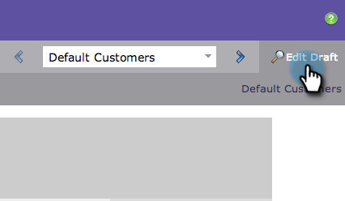

# Pré-visualização de uma Landing page {#preview-a-landing-page}

Você provavelmente quer ver como sua landing page se parece antes de fazê-la viver.

## Pré-visualização de uma Landing page {#preview-a-landing-page-1}

1. Selecione uma landing page e clique em **Página de Pré-visualização**.

   

   >[!NOTE]
   >
   >O rascunho é a versão em que você está trabalhando, não a versão ao vivo que os clientes veem.

1. Você também pode clicar com o botão direito do mouse em sua landing page e selecionar **Pré-visualização**.

   

## Pré-visualização de um rascunho de Landing page {#preview-a-landing-page-draft}

1. Clique com o botão direito do mouse em uma landing page aprovada que tenha uma versão de rascunho e clique em **Rascunho de Pré-visualização**.

   

## Pré-visualização de um rascunho de Landing page ao editar {#preview-a-landing-page-draft-while-editing}

1. Selecione uma landing page e clique em **Editar rascunho**.

   

1. A qualquer momento durante seu trabalho no editor de landings page, você pode clicar em **Rascunho de Pré-visualização**.

   

1. Você pode retornar rapidamente à edição clicando em **Editar rascunho**.

   

Bom trabalho! Agora você sabe como pré-visualização landings page.
