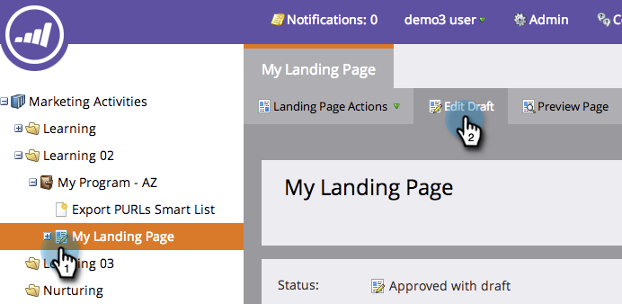

# Visualizar uma página de aterrissagem {#preview-a-landing-page}

Você provavelmente quer ver a aparência da sua landing page antes de ativá-la.

## Visualizar uma página de aterrissagem {#preview-a-landing-page-1}

1. Selecione uma página de aterrissagem e clique em **Visualizar página**.

   

   >[!NOTE]
   >
   >O rascunho é a versão em que você está trabalhando, não a versão em tempo real que os clientes veem.

1. Você também pode clicar com o botão direito do mouse na sua página de aterrissagem e selecionar **Visualizar**.

   

## Visualizar um rascunho de página de aterrissagem {#preview-a-landing-page-draft}

1. Clique com o botão direito em uma página de aterrissagem aprovada que tenha uma versão de rascunho e clique em **Visualizar rascunho**.

   

## Visualizar um rascunho de página de aterrissagem ao editar {#preview-a-landing-page-draft-while-editing}

1. Selecione uma página de aterrissagem e clique em **Editar rascunho**.

   

1. Em qualquer momento durante seu trabalho no editor de páginas de aterrissagem, você pode clicar em **Visualizar Rascunho**.

   

1. Você pode retornar rapidamente à edição clicando em **Editar rascunho**.

   

Bom trabalho! Agora você sabe como visualizar páginas de aterrissagem.
