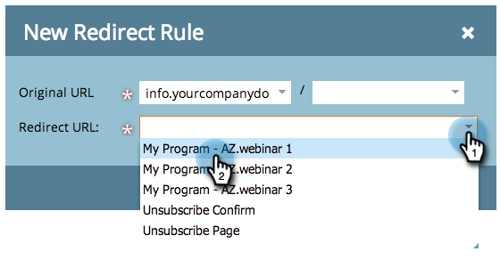

# Redirecionar uma página de destino do Marketo para outra página {#redirect-a-marketo-landing-page-to-another-page}

Se você atualizar o URL de uma página e quiser que o URL antigo ainda funcione, tente um redirecionamento! Configurar é fácil.

>[!NOTE]
>
>**Permissões de administrador necessárias**

1. Em **[!UICONTROL Admin]**, clique em **[!UICONTROL Páginas de Aterrissagem]**.

   

1. Na guia **[!UICONTROL Regras]**, clique em **[!UICONTROL Nova]** e em **[!UICONTROL Nova Regra de Redirecionamento]**.

   

1. Clique no primeiro menu suspenso **[!UICONTROL URL Original]** e selecione seu Marketo [CNAME](/help/marketo/product-docs/demand-generation/landing-pages/landing-page-actions/customize-your-landing-page-urls-with-a-cname.md).

   

   >[!NOTE]
   >
   >Lembre-se, você só pode redirecionar URLs que comecem com seu [CNAME](/help/marketo/product-docs/demand-generation/landing-pages/landing-page-actions/customize-your-landing-page-urls-with-a-cname.md) do Marketo.

1. Escolha a página de aterrissagem que deseja redirecionar no segundo campo **[!UICONTROL URL Original]**.

   

   >[!NOTE]
   >
   >Você pode inserir qualquer caminho de URL, mesmo se a página ou o diretório não existir.

1. Clique no menu suspenso **[!UICONTROL Redirecionar URL]** e selecione a página para a qual deseja redirecionar visitantes.

   

1. Clique em **[!UICONTROL Criar]**.

   

   >[!TIP]
   >
   >Para redirecionar para uma página da Web fora do Marketo, clique em **[!UICONTROL Usar página de aterrissagem que não seja da Marketo]**.

   >[!MORELIKETHIS]
   >
   >[Redirecionar um Caminho de URL](/help/marketo/product-docs/demand-generation/landing-pages/personalizing-landing-pages/redirect-a-url-path.md)
