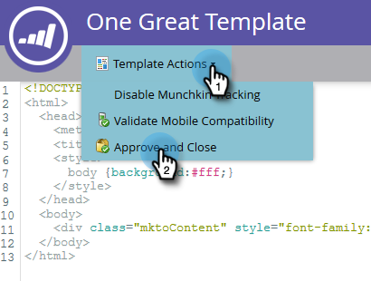

# Criar um modelo de página de aterrissagem de forma livre {#create-a-free-form-landing-page-template}

Páginas de aterrissagem de forma livre exigem menos conhecimento técnico do que seus homólogos guiados. Para criar um template para landing pages futuras, siga as etapas abaixo.

1. Vá para o **Design Studio**.

   

1. Clique em **Novo** e selecione **Novo modelo de página de aterrissagem**.

   

1. Escolha a pasta e nomeie o modelo. Forma livre é o modo de edição padrão, portanto, depois de nomear seu modelo, clique em **Criar**.

   

1. Seu modelo deve abrir em uma nova guia. Agora ele pode ser editado por qualquer pessoa familiarizada com CSS/HTML.

   

   >[!NOTE]
   >
   >O Suporte da Marketo não está configurado para ajudar na solução de problemas de HTML personalizado. Para obter assistência para o HTML, consulte um desenvolvedor da Web.

1. Quando terminar de fazer edições, clique em **Ações de Modelo** e selecione **Aprovar e Fechar**.

   

   Agora você tem um novo modelo de página de aterrissagem de forma livre!

   >[!NOTE]
   >
   >Selecione **Desabilitar rastreamento do Munchkin** se quiser impedir que os formulários sejam preenchidos previamente ou se não quiser apenas rastrear o comportamento da Web em uma página específica.\
   >Selecione **Validar Compatibilidade Móvel** para verificar se o código é compatível com dispositivos móveis.

   >[!MORELIKETHIS]
   >
   >* [Criar uma Página de Aterrissagem de Formato Livre](/help/marketo/product-docs/demand-generation/landing-pages/free-form-landing-pages/create-a-free-form-landing-page.md)
   >* [Criar um modelo de página de aterrissagem guiada](/help/marketo/product-docs/demand-generation/landing-pages/landing-page-templates/create-a-guided-landing-page-template.md)
   >* [Noções básicas sobre forma livre vs. páginas de aterrissagem guiadas](/help/marketo/product-docs/demand-generation/landing-pages/understanding-landing-pages/understanding-free-form-vs-guided-landing-pages.md)
