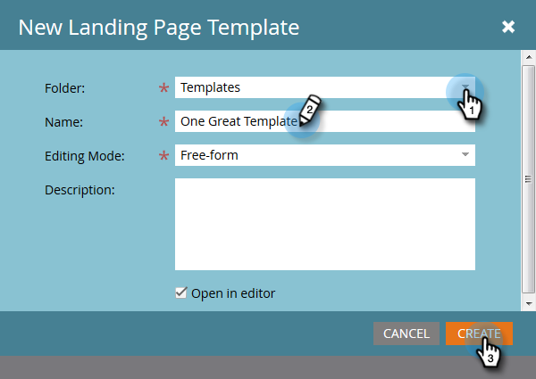

# Criar um modelo de página de aterrissagem de forma livre {#create-a-free-form-landing-page-template}

As landing pages de forma livre exigem menos conhecimento técnico do que as páginas guiadas. Para criar um modelo para landing pages futuras, siga as etapas abaixo.

1. Ir para **Design Studio**.

   

1. Clique em **Novo**, em seguida selecione **Novo modelo de página de aterrissagem**.

   

1. Escolha a pasta e dê um nome ao template. O Forma livre é o modo de edição padrão, portanto, depois de nomear o modelo, clique em **Criar**.

   

1. Seu template deve abrir em uma nova guia. Agora é editável para qualquer pessoa familiarizada com CSS/HTML.

   

   >[!NOTE]
   >
   >O Suporte da Marketo não está configurado para ajudar na solução de problemas do HTML personalizado. Para obter assistência para o HTML, consulte um desenvolvedor da Web.

1. Quando terminar de fazer edições, clique em **Ações do modelo**, em seguida selecione **Aprovar e fechar**.

   

   Agora você tem um novo modelo de página de aterrissagem de forma livre!

   >[!NOTE]
   >
   >Selecionar **Desativar o rastreamento do Munchkin** caso deseje evitar que os formulários sejam preenchidos previamente, ou caso não queira rastrear o comportamento da Web em uma página específica.\
   >Selecionar **Validar a compatibilidade móvel** para garantir que seu código seja compatível com dispositivos móveis.

   >[!MORELIKETHIS]
   >
   >* [Criar uma página de aterrissagem de forma livre](/help/marketo/product-docs/demand-generation/landing-pages/free-form-landing-pages/create-a-free-form-landing-page.md)
   >* [Criar um modelo de página de aterrissagem guiada](/help/marketo/product-docs/demand-generation/landing-pages/landing-page-templates/create-a-guided-landing-page-template.md)
   >* [Entendendo as páginas de aterrissagem guiadas e de forma livre](/help/marketo/product-docs/demand-generation/landing-pages/understanding-landing-pages/understanding-free-form-vs-guided-landing-pages.md)

