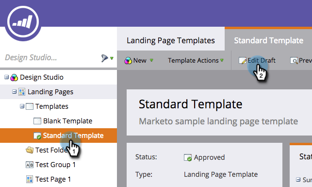

# Editar um modelo de página de aterrissagem do Marketo {#edit-a-marketo-landing-page-template}

É possível editar qualquer template de landing page no Marketo.

1. Vá para o **Design Studio**.

   

1. Expanda **Landing Pages** para mostrar os modelos.

   

1. Selecione o **Modelo** que deseja editar. Clique em **Editar rascunho**.

   

   Concluído! Agora é possível editar o CSS do modelo e ter controle total sobre sua aparência e layout.

   >[!NOTE]
   >
   >Ao editar um modelo de página de aterrissagem, ele criará um rascunho de qualquer ativo de página de aterrissagem usando esse modelo.
