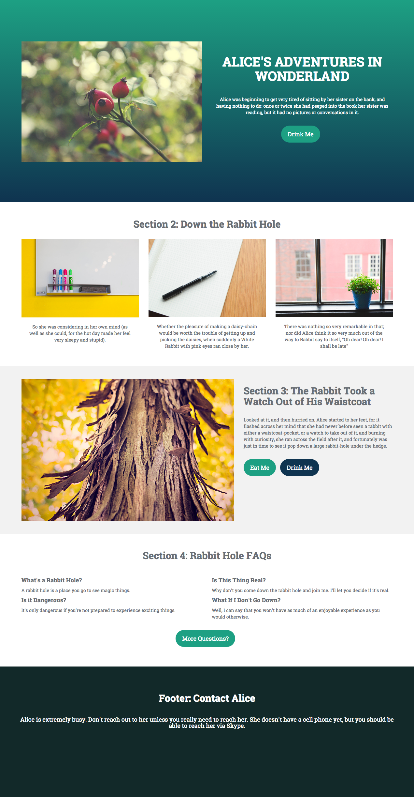

# Modelo 1-A {#template-a}

[Modelo de download 1-A](http://docs.marketo.com/download/attachments/7515620/template1-a.html?version=3&amp;modificationdate=1432834576000&amp;api=v2)

Este modelo inclui o seguinte conteúdo:

* Uma seção primária

   * inclui imagem principal, cabeçalho, texto do corpo e botão.

* Três seções de corpo (opcional)
* Rodapé (opcional)

**Clique abaixo para baixar este modelo:**

[Modelo1-A.html](http://docs.marketo.com/download/attachments/7515620/template1-a.html?version=3&amp;modificationdate=1432834576000&amp;api=v2)
