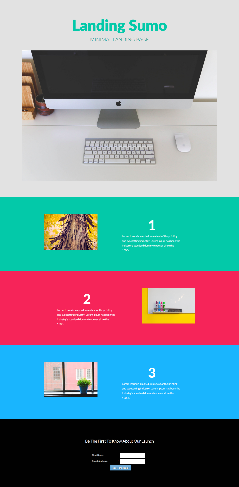

# Modelo 10B {#template-10b}

Clique com o botão direito do mouse em [baixar Modelo 10B](https://51837-micrositemarketo.adobeio-static.net/lp-templates/template-10b.html) e selecione **Salvar link como...**

>[!NOTE]
>
>As etapas completas sobre como baixar e importar um modelo [podem ser encontradas aqui](/help/marketo/product-docs/demand-generation/landing-pages/landing-page-templates/guided-landing-page-template-list.md#how-to-import){target="_blank"}.

Esse template inclui o seguinte conteúdo:

* Uma seção principal

  * Inclui um cabeçalho herói, um texto herói e uma imagem herói

* Três seções do corpo (opcional)
* Um rodapé (opcional)

**Clique com o botão direito do mouse abaixo (e selecione _Salvar link como..._) para baixar este modelo:**

[Modelo 10B.html](https://51837-micrositemarketo.adobeio-static.net/lp-templates/template-10b.html)
