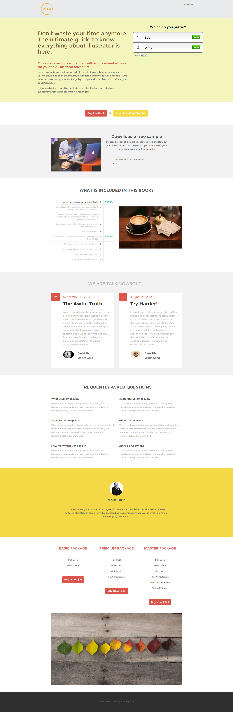

# Modelo 12-C {#template-c}

[Fazer download do modelo 12-C](https://docs.marketo.com/download/attachments/9437580/template-12c.html?version=1&amp;modificationdate=1438211583000&amp;api=v2)

Este modelo inclui o seguinte conteúdo:

* Um cabeçalho (opcional)
* Uma seção primária

   * inclui título de herói, texto de herói e pesquisa

* Seis seções do corpo (opcional)
* Rodapé (opcional)

**Clique abaixo para baixar este modelo:**

[Template12-C.html](https://docs.marketo.com/download/attachments/9437580/template-12c.html?version=1&amp;modificationdate=1438211583000&amp;api=v2)
