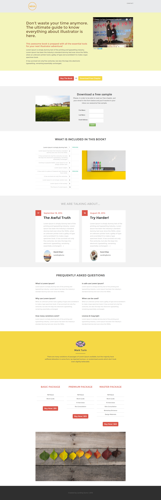

# Modelo 12B {#template-12b}

Clique com o botão direito para [baixar o Modelo 12B](https://experienceleague.adobe.com/landing/marketo/lp-templates/template-12b.html)

Esse template inclui o seguinte conteúdo:

* Um cabeçalho (opcional)
* Uma seção principal

   * inclui título herói, texto herói e imagem herói

* Seis seções da carroçaria (opcional)
* Rodapé (opcional)

**Clique com o botão direito do mouse abaixo para baixar este modelo:**

[Modelo 12B.html](https://experienceleague.adobe.com/landing/marketo/lp-templates/template-12b.html)
