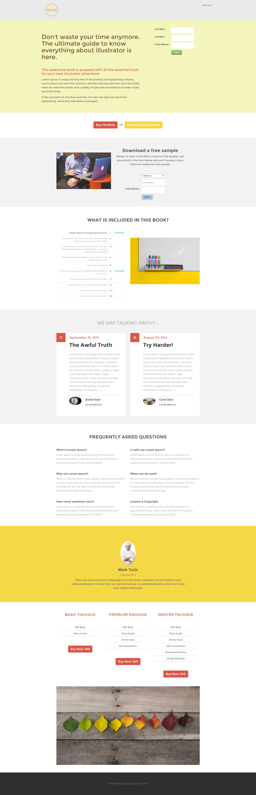

# Modelo 12D {#template-12d}

Clique com o botão direito do mouse em [baixar Modelo 12D](https://experienceleague.adobe.com/landing/marketo/lp-templates/template-12d.html)

Esse template inclui o seguinte conteúdo:

* Um cabeçalho (opcional)
* Uma seção primária

   * inclui título de herói, texto de herói e formulário

* Seis seções do corpo (opcional)
* Rodapé (opcional)

**Clique com o botão direito do mouse abaixo para baixar este modelo:**

[Modelo 12D.html](https://experienceleague.adobe.com/landing/marketo/lp-templates/template-12d.html)
