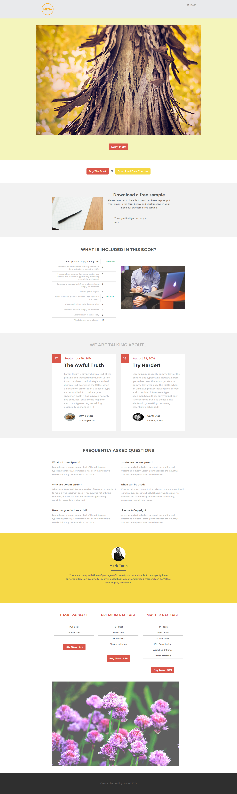

# Modelo 12F {#template-12f}

Clique com o botão direito para [baixar o Modelo 12F](https://51837-micrositemarketo.adobeio-static.net/lp-templates/template-12f.html)

Esse template inclui o seguinte conteúdo:

* Um cabeçalho (opcional)
* Uma seção principal

  * inclui imagem principal e link Saiba mais

* Seis seções da carroçaria (opcional)
* Rodapé (opcional)

**Clique com o botão direito do mouse abaixo para baixar este modelo:**

[Modelo 12F.html](https://51837-micrositemarketo.adobeio-static.net/lp-templates/template-12f.html)
