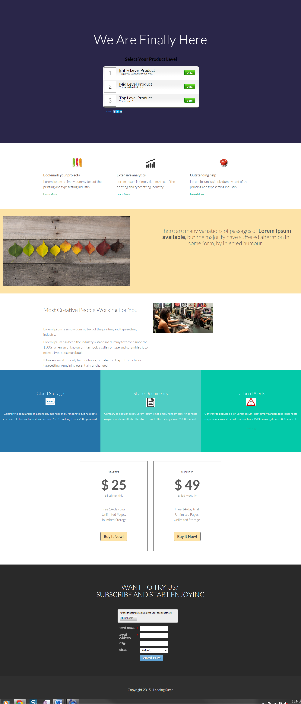

# Modelo 13C {#template-13c}

Clique com o botão direito para [baixar o Modelo 13C](https://51837-micrositemarketo.adobeio-static.net/lp-templates/template-13c.html)

Esse template inclui o seguinte conteúdo:

* Uma seção principal

  * inclui título de herói e enquete

* Cinco seções de corpo (opcional)
* Rodapé (opcional)

**Clique com o botão direito do mouse abaixo para baixar este modelo:**

[Modelo13C.html](https://51837-micrositemarketo.adobeio-static.net/lp-templates/template-13c.html)
