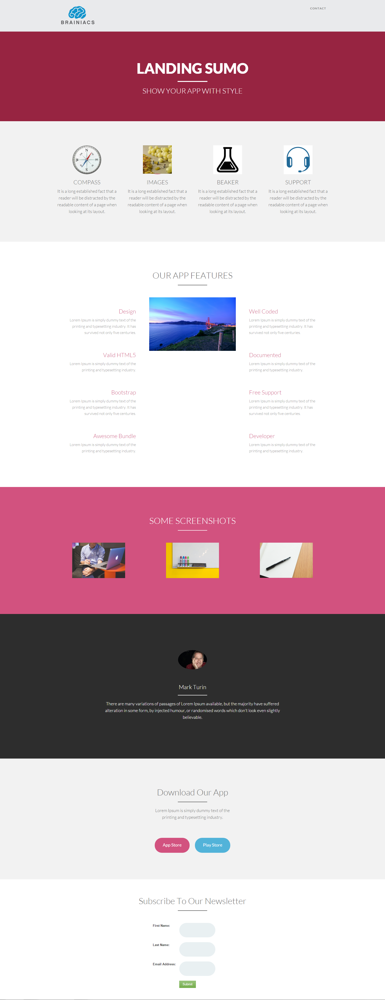

# Modelo 14A {#template-14a}

Clique com o botão direito para [baixar o Modelo 14A](https://experienceleague.adobe.com/landing/marketo/lp-templates/template-14a.html?lang=pt-BR)

Esse template inclui o seguinte conteúdo:

* Um cabeçalho (opcional)
* Uma seção principal

   * Inclui título e texto herói

* Cinco seções de corpo (opcional)
* Rodapé (opcional)

**Clique com o botão direito do mouse abaixo para baixar este modelo:**

[Modelo 14A.html](https://experienceleague.adobe.com/landing/marketo/lp-templates/template-14a.html?lang=pt-BR)
