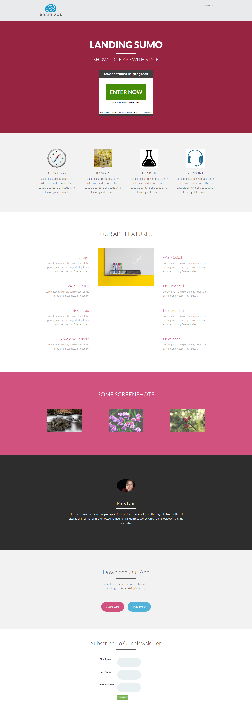

# Modelo 14D {#template-14d}

Clique com o botão direito para [baixar o Modelo 14D](https://51837-micrositemarketo.adobeio-static.net/lp-templates/template-14d.html)

Esse template inclui o seguinte conteúdo:

* Um cabeçalho (opcional)
* Uma seção principal

  * inclui título herói, texto herói e sorteios

* Cinco seções de corpo (opcional)
* Rodapé (opcional)

**Clique com o botão direito do mouse abaixo para baixar este modelo:**

[Modelo 14D.html](https://51837-micrositemarketo.adobeio-static.net/lp-templates/template-14d.html)
