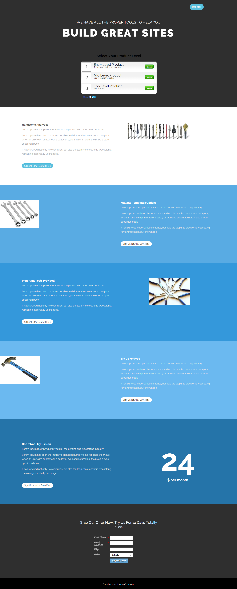

# Modelo 15C {#template-15c}

Clique com o botão direito para [baixar o Modelo 15C](https://experienceleague.adobe.com/landing/marketo/lp-templates/template-15c.html?lang=pt-BR)

Esse template inclui o seguinte conteúdo:

* Uma seção principal

   * inclui título de herói e pesquisa

* Cinco seções de corpo (opcional)
* Rodapé (opcional)

**Clique com o botão direito do mouse abaixo para baixar este modelo:**

[Modelo 15C.html](https://experienceleague.adobe.com/landing/marketo/lp-templates/template-15c.html?lang=pt-BR)
