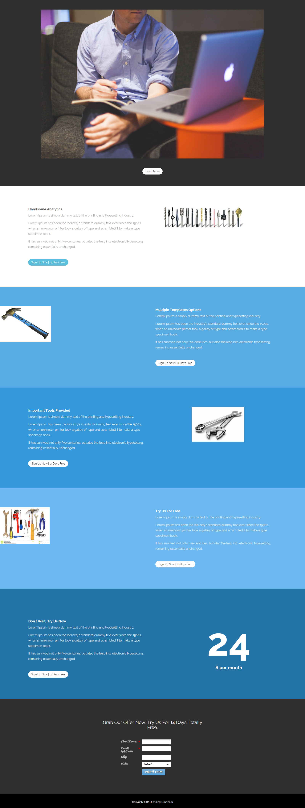

# Modelo 15E {#template-15e}

Clique com o botão direito do mouse em [baixar Modelo 15E](https://51837-micrositemarketo.adobeio-static.net/lp-templates/template-15e.html) e selecione **Salvar link como...**

>[!NOTE]
>
>As etapas completas sobre como baixar e importar um modelo [podem ser encontradas aqui](/help/marketo/product-docs/demand-generation/landing-pages/landing-page-templates/guided-landing-page-template-list.md#how-to-import){target="_blank"}.

Esse template inclui o seguinte conteúdo:

* Uma seção principal

  * inclui uma imagem herói e o botão Saiba mais

* Cinco seções de corpo (opcional)
* Rodapé (opcional)

**Clique com o botão direito do mouse abaixo (e selecione _Salvar link como..._) para baixar este modelo:**

[Modelo 15E.html](https://51837-micrositemarketo.adobeio-static.net/lp-templates/template-15e.html)
