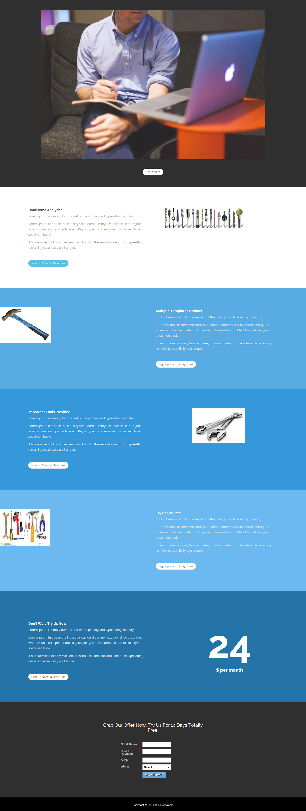

# Modelo 15E {#template-15e}

[Download do modelo 15E](https://experienceleague.adobe.com/landing/marketo/lp-templates/template-15e.html)

Esse template inclui o seguinte conteúdo:

* Uma seção primária

   * inclui uma imagem principal e o botão Saiba mais

* Cinco seções do corpo (opcional)
* Rodapé (opcional)

**Clique abaixo para baixar este modelo:**

[Modelo 15E.html](https://experienceleague.adobe.com/landing/marketo/lp-templates/template-15e.html)
