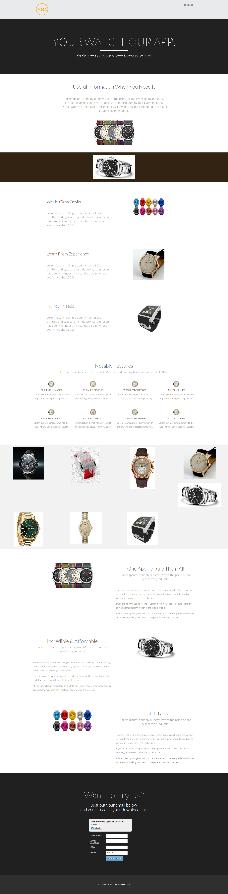

# Modelo 16A {#template-16a}

Clique com o botão direito para [baixar o Modelo 16A](https://experienceleague.adobe.com/landing/marketo/lp-templates/template-16a.html)

Esse template inclui o seguinte conteúdo:

* Um cabeçalho (opcional)
* Uma seção principal

   * inclui título e texto herói

* Seis seções do corpo
* Rodapé (opcional)

**Clique com o botão direito do mouse abaixo para baixar este modelo:**

[Modelo 16A.html](https://experienceleague.adobe.com/landing/marketo/lp-templates/template-16a.html)
