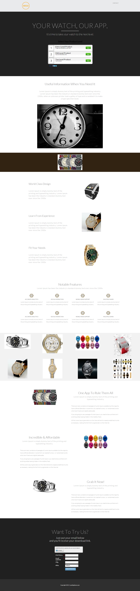

# Modelo 16C {#template-16c}

Clique com o botão direito para [baixar o Modelo 16C](https://experienceleague.adobe.com/landing/marketo/lp-templates/template-16c.html)

Esse template inclui o seguinte conteúdo:

* Um cabeçalho (opcional)
* Uma seção principal

   * inclui título de herói e pesquisa

* Seis seções da carroçaria (opcional)
* Rodapé (opcional)

**Clique com o botão direito do mouse abaixo para baixar este modelo:**

[Modelo 16C.html](https://experienceleague.adobe.com/landing/marketo/lp-templates/template-16c.html)
