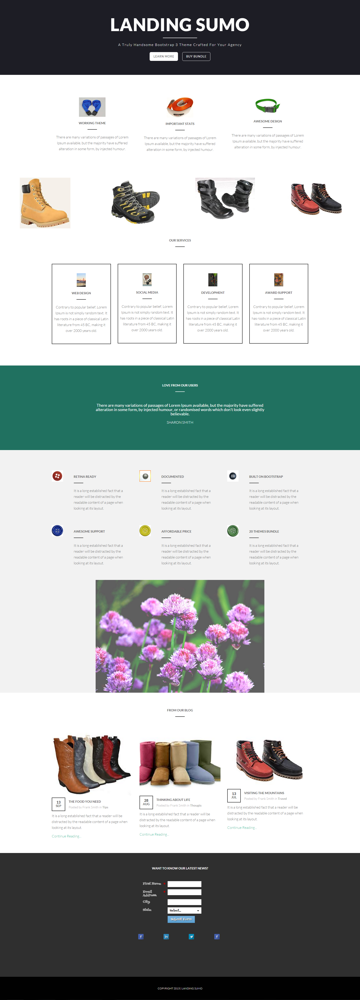

# Modelo 17A {#template-17a}

Clique com o botão direito do mouse em [baixar modelo 17A](https://51837-micrositemarketo.adobeio-static.net/lp-templates/template-17a.html) e selecione **Salvar link como...**

>[!NOTE]
>
>As etapas completas sobre como baixar e importar um modelo [podem ser encontradas aqui](/help/marketo/product-docs/demand-generation/landing-pages/landing-page-templates/guided-landing-page-template-list.md#how-to-import){target="_blank"}.

Esse template inclui o seguinte conteúdo:

* Uma seção principal

  * inclui título herói, texto herói e dois botões

* Seis seções da carroçaria (opcional)
* Rodapé (opcional)

**Clique com o botão direito do mouse abaixo (e selecione _Salvar link como..._) para baixar este modelo:**

[Modelo 17A.html](https://51837-micrositemarketo.adobeio-static.net/lp-templates/template-17a.html)
