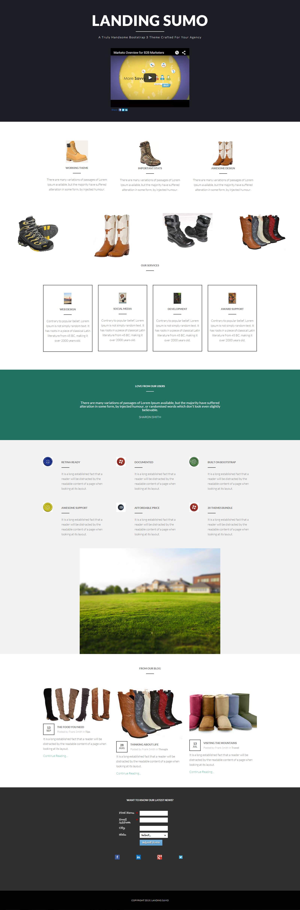

# Modelo 17B {#template-17b}

Clique com o botão direito para [baixar o Modelo 17B](https://experienceleague.adobe.com/landing/marketo/lp-templates/template-17b.html?lang=pt-BR)

Esse template inclui o seguinte conteúdo:

* Uma seção principal

   * inclui título herói, texto herói e vídeo

* Seis seções da carroçaria (opcional)
* Rodapé (opcional)

**Clique com o botão direito do mouse abaixo para baixar este modelo:**

[Modelo 17B.html](https://experienceleague.adobe.com/landing/marketo/lp-templates/template-17b.html?lang=pt-BR)
