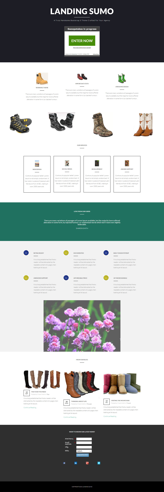

# Modelo 17-D {#template-17d}

Clique com o botão direito do mouse para [baixar o Modelo 17-D](https://experienceleague.adobe.com/landing/marketo/lp-templates/template-17d.html)

Esse template inclui o seguinte conteúdo:

* Uma seção principal

   * inclui título herói, texto herói e sorteios

* Seis seções da carroçaria (opcional)
* Rodapé (opcional)

**Clique com o botão direito do mouse abaixo para baixar este modelo:**

[Modelo 17-D.html](https://experienceleague.adobe.com/landing/marketo/lp-templates/template-17d.html)
