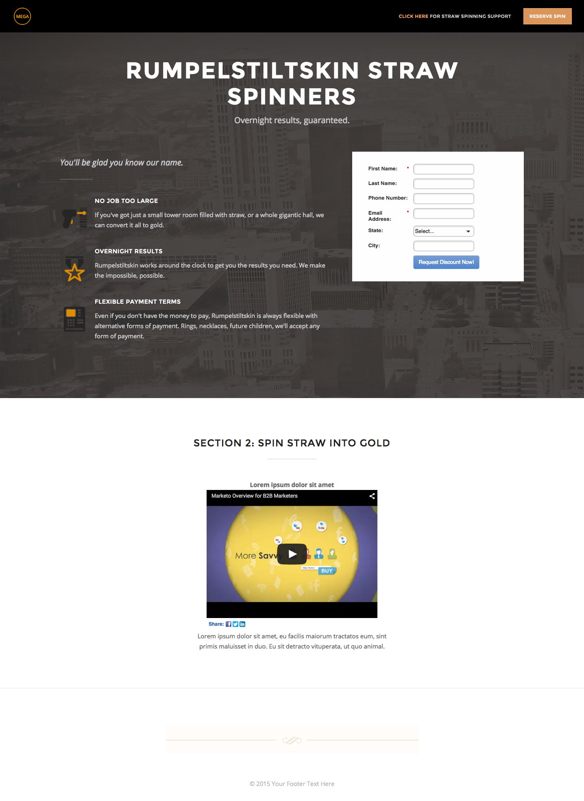

# Modelo 2-B {#template-b}

[Modelo de download 2-B](http://docs.marketo.com/download/attachments/7516470/template2-b.html?version=1&amp;modificationdate=1433229058000&amp;api=v2)

Este modelo inclui o seguinte conteúdo:

* Um cabeçalho com logotipo e botão (opcional)
* Uma seção primária

   * inclui imagem de plano de fundo principal, cabeçalho, slogan, lista com marcadores e formulário.

* Uma seção de corpo com vídeo e texto (opcional)
* Rodapé (opcional)

**Clique abaixo para baixar este modelo:**

[Template2-B.html](http://docs.marketo.com/download/attachments/7516470/template2-b.html?version=1&amp;modificationdate=1433229058000&amp;api=v2)
