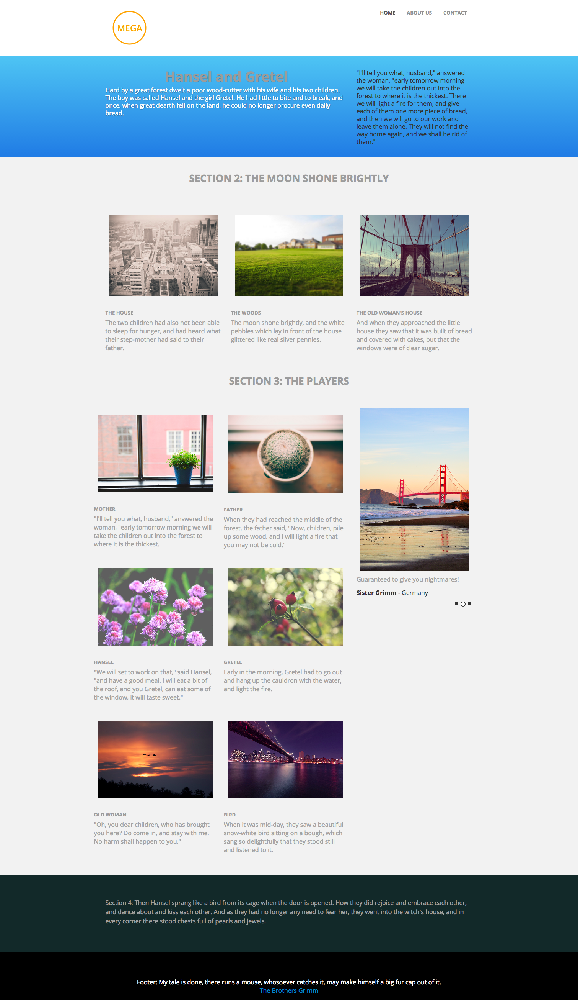

# Modelo 3D {#template-3d}

Clique com o botão direito do mouse para [baixar Modelo 3D](https://experienceleague.adobe.com/landing/marketo/lp-templates/template-3d.html)

Esse template inclui o seguinte conteúdo:

* Um cabeçalho com logotipo e 3 botões (opcional)
* Uma seção principal

   * inclui texto herói.

* Três seções do corpo (opcional)
* Rodapé (opcional)

**Clique com o botão direito do mouse abaixo para baixar este modelo:**

[Modelo 3D.html](https://experienceleague.adobe.com/landing/marketo/lp-templates/template-3d.html)
