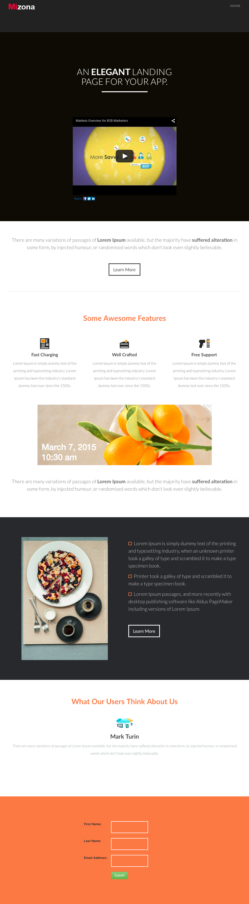

# Modelo 7B {#template-7b}

Clique com o botão direito para [baixar o Modelo 7B](https://experienceleague.adobe.com/landing/marketo/lp-templates/template-7b.html?lang=pt-BR)

Esse template inclui o seguinte conteúdo:

* Um cabeçalho (opcional)
* Uma seção principal

   * inclui um cabeçalho e um vídeo

* Quatro seções do corpo (opcional)
* Um rodapé (opcional)

**Clique com o botão direito do mouse abaixo para baixar este modelo:**

[Modelo 7B.html](https://experienceleague.adobe.com/landing/marketo/lp-templates/template-7b.html?lang=pt-BR)
