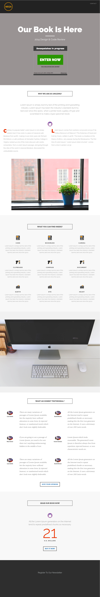

# Modelo 8F {#template-8f}

Clique com o botão direito do mouse para [baixar o Modelo 8F](https://experienceleague.adobe.com/landing/marketo/lp-templates/template-8f.html)

Esse template inclui o seguinte conteúdo:

* Um cabeçalho (opcional)
* Uma seção principal

   * inclui um cabeçalho herói, um texto herói e um jogo de varredura

* Cinco seções de corpo (opcional)
* Um rodapé (opcional)

**Clique com o botão direito do mouse abaixo para baixar este modelo:**

[Modelo 8F.html](https://experienceleague.adobe.com/landing/marketo/lp-templates/template-8f.html)
