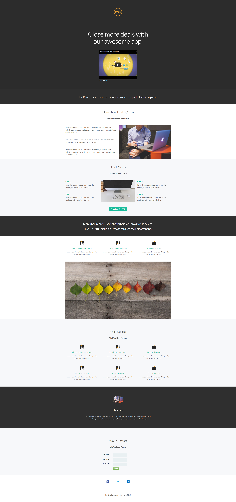

# Modelo 9C {#template-9c}

[Fazer download do modelo 9C](https://experienceleague.adobe.com/landing/marketo/lp-templates/template-9c.html)

Esse template inclui o seguinte conteúdo:

* Uma seção primária

   * inclui uma imagem de logotipo, um vídeo e um cabeçalho herói

* Oito seções do corpo (opcional)
* Um rodapé (opcional)

**Clique abaixo para baixar este modelo:**

[Modelo 9C.html](https://experienceleague.adobe.com/landing/marketo/lp-templates/template-9c.html)
