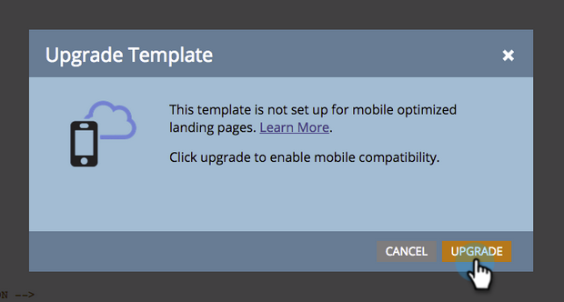

# Tornar um Modelo de Página de Aterrissagem de Formato Livre Existente [!UICONTROL Compatível com Dispositivos Móveis] {#make-an-existing-free-form-landing-page-template-mobile-compatible}

Isso pode ser feito em dois lugares, o Editor de modelo e o Editor de landing page.

## Atualizar a partir do Editor de modelo {#upgrade-from-the-template-editor}

1. Vá para o **[!UICONTROL Design Studio]**.

   

1. Selecione **[!UICONTROL Modelos]**.

   

1. Selecione um modelo em que **[!UICONTROL Compatível com Dispositivos Móveis]** seja **[!UICONTROL Não]**.

   

1. Clique em **[!UICONTROL Editar rascunho]**.

   

1. Clique em **[!UICONTROL Tornar o Mobile compatível]**.

   

1. Clique em **[!UICONTROL Atualizar]**.

   

   Seu template de landing page agora é compatível com dispositivos móveis!

   >[!NOTE]
   >
   >A atualização deve ser inofensiva, mas verifique se há discrepâncias nas páginas. A atualização criará rascunhos de qualquer landing page que use esse modelo.

   

## O que torna um modelo [!UICONTROL compatível com dispositivos móveis]? {#what-makes-a-template-mobile-compatible}

Ótimas perguntas! Seu modelo deve ter as seguintes tags:

`Must have <!DOCTYPE HTML> Must have a <HEAD> element Must have a <TITLE> in the <HEAD> element Must have <META CHARSET="UTF-8"> within the <HEAD> element Must have a <BODY> element that contains one (and only one) 

`

Se tudo estiver bem, você verá esta mensagem.

Se algo estiver errado, uma mensagem de erro será exibida. Clique em reparar para corrigir o problema e repetir o processo de validação.

Se você fizer alterações no modelo, clique em [!UICONTROL Ações do Modelo] e selecione [!UICONTROL Validar Compatibilidade Móvel].

## Atualização de um modelo do editor de página de aterrissagem de forma livre {#upgrading-a-template-from-the-free-form-landing-page-editor}

Ao editar uma landing page e clicar na guia móvel, às vezes você notará que o template não foi atualizado. Não tema! Você pode atualizá-lo lá mesmo.

1. Clique na guia **[!UICONTROL Mobile]**.

   

1. Clique na caixa de seleção e clique em **[!UICONTROL Ativar]**.

   

   >[!NOTE]
   >
   >Ativar a versão móvel de um modelo criará rascunhos de qualquer landing page que o use.

Fantástico! Agora você pode [personalizar a exibição móvel](/help/marketo/product-docs/demand-generation/landing-pages/free-form-landing-pages/customize-mobile-view-for-your-free-form-landing-page.md) de todas as páginas de aterrissagem que usam este modelo.
