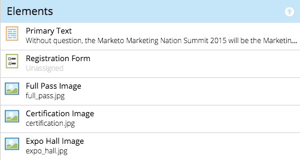

# Noções básicas sobre elementos e variáveis em modelos guiados {#understanding-elements-and-variables-in-guided-templates}

Os modelos de página de aterrissagem guiada têm dois tipos de seções editáveis: elementos e variáveis.

## Elementos {#elements}

Os elementos são os diferentes conteúdos que compõem uma landing page. Eles podem ser imagens, texto ou ativos do Marketo.

Ao editar uma landing page guiada, os elementos serão exibidos se forem marcados como editáveis no template. Os elementos terão os seguintes ícones:

*  Imagem
* Formulário Marketo
* Texto
* Vídeo
* Botão Compartilhar do Marketo
* Votação Marketo
* Referência do Marketo
* Sweepstakes do Marketo
* Fragmento do Marketo

## Variáveis {#variables}

As variáveis são atributos semelhantes a tokens que podem ser personalizados no editor de página de aterrissagem guiado, como mostrado abaixo.

Há três tipos de variáveis: variáveis de string, variáveis de cor e variáveis booleanas.

<table>
 <tbody>
  <tr>
   <td>String</td>
   <td>
Texto editável

Exemplo: títulos, datas, rótulos de botão
</td>
  </tr>
  <tr>
   <td>Cor</td>
   <td>
Código hexadecimal editável para cor

Exemplo: cor do plano de fundo, cor da fonte, cor da borda
</td>
  </tr>
  <tr>
   <td>Booleano</td>
   <td>
Uma alavanca que controla os estados ligado/desligado para objetos ou formatos na página de aterrissagem

Exemplos: Mostrar Rodapé (Sim/Não), Contagem De Colunas (1/2), Incorporar Google Analytics (Verdadeiro/Falso)
</td>
  </tr>
 </tbody>
</table>

>[!MORELIKETHIS]
>
>[Criar um modelo de página de aterrissagem guiada](/help/marketo/product-docs/demand-generation/landing-pages/landing-page-templates/create-a-guided-landing-page-template.md)
