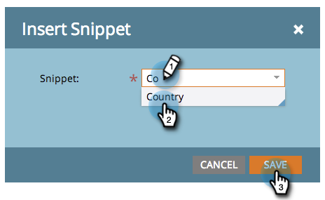

# Adicionar um snippet a uma página de destino {#add-a-snippet-to-a-landing-page}

Os trechos são blocos reutilizáveis do HTML que podem seguir regras e manter conteúdo personalizado.

>[!PREREQUISITES]
>
>[Criar um trecho](/help/marketo/product-docs/personalization/segmentation-and-snippets/snippets/create-a-snippet.md)

1. Selecione sua página de aterrissagem e clique em **[!UICONTROL Editar rascunho]**.

   

1. No editor de páginas de aterrissagem, arraste sobre o elemento **[!UICONTROL Trecho]**.

   

1. Localize o seu trecho, selecione-o e clique em **[!UICONTROL Salvar]**.

   

   >[!TIP]
   >
   >Se não conseguir encontrar o trecho, verifique se ele foi aprovado primeiro.

   >[!NOTE]
   >
   >Se quiser adicionar um trecho a uma Página de Aterrissagem Guiada, consulte [este artigo](/help/marketo/product-docs/demand-generation/landing-pages/landing-page-templates/create-a-guided-landing-page-template.md).

Agora você sabe como adicionar trechos às suas páginas de aterrissagem.
