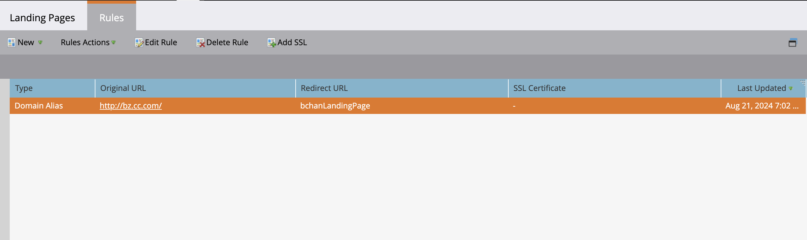

# Adicionar SSL às páginas de destino {#add-ssl-to-your-landing-pages}

A criptografia SSL (Secure Socket Layer) permite proteger todas as suas Landing Pages para uma instância do Marketo Engage.

Por padrão, ao preencher um formulário da Web ou visitar uma landing page hospedada pela Marketo Engage, as informações são enviadas por protocolo não seguro (HTTP). De acordo com a política da empresa, talvez você queira proteger as informações enviadas à Marketo no (HTTPS). Por exemplo, quando você visitar `http://info.mydomain.com/`, agora será `https://info.mydomain.com/`.

O Marketo Engage rastreia &quot;Página da Web visitada&quot; e &quot;Clique no link na página da Web&quot; por padrão por protocolo HTTP não seguro. Para ter os links de rastreamento protegidos com seu próprio certificado, o Marketo precisa criar um servidor não compartilhado separado para habilitá-lo. Proteger todos os aspectos da interação de um contato com você normalmente significa proteger tanto as páginas de aterrissagem quanto os links de rastreamento.

>[!IMPORTANT]
>
>Antes de adicionar um SSL, certifique-se de verificar seu contrato quanto ao número total de domínios que você tem permissão para adicionar. Caso contrário, você pode incorrer em uma taxa. Se não conseguir encontrar as informações, entre em contato com a Equipe de contas da Adobe (seu gerente de conta) para obter detalhes.

## Habilitar certificação SSL {#enable-ssl-certification}

Adicione SSL automaticamente para todos os aliases de domínio criados como parte das regras de página inicial.

1. Vá para a área **Administrador**.

   

1. Selecione **Páginas de aterrissagem** na árvore. Na guia **Regras**, clique no menu suspenso **Novo** e selecione **Novo Alias de Domínio**.

   

1. Insira seu _Alias de Domínio_ e _Página Padrão_. Marque a caixa de seleção **Gerar certificado SSL**. Clique em **Criar** quando terminar.

   

Isso adiciona automaticamente um certificado SSL a esse domínio.

## Habilitar SSL para o domínio padrão {#enable-ssl-default-domain}

Siga as etapas abaixo para ativar o SSL para seu domínio padrão.

1. Ainda na seção **Admin**, selecione **Landing Pages**. Clique no botão laranja **Editar** ao lado de _Configurações_.

   {width="800" zoomable="yes"}

   >[!NOTE]
   >
   >Se desejar, também é possível modificar o nome do domínio aqui (é necessário um domínio válido).

1. Marque a caixa de seleção &quot;Gerar certificado SSL&quot; e clique em Salvar.

   

>[!NOTE]
>
>Pode levar até três minutos para que o SSL esteja no estado PRONTO. Atualize a página para que as alterações sejam exibidas.

## Editar SSLs para aliases de domínios existentes

Siga estas etapas para habilitar o SSL para seus aliases de domínio existentes.

1. Na área _[!UICONTROL Administrador]_, expanda **[!UICONTROL Integração]** na navegação à esquerda e selecione **[!UICONTROL Páginas de Aterrissagem]**.

1. Na página, selecione a guia **[!UICONTROL Regras]** na parte superior.

1. Selecione a linha de alias de domínio que você deseja editar e clique em **[!UICONTROL Adicionar SSL]** na parte superior.

   {width="800" zoomable="yes"}

1. Na caixa de diálogo, clique em **[!UICONTROL Confirmar]**.

   {width="400"}

>[!NOTE]
>
>Pode levar até três minutos para que o SSL esteja no estado PRONTO. Atualize a página para que as alterações sejam exibidas.

## Mensagens de erro {#error-messages}

Abaixo você encontrará mensagens de erro que poderá receber junto com suas definições.

<table><thead>
  <tr>
    <th>Erro</th>
    <th>Detalhes</th>
  </tr></thead>
<tbody>
<tr>
    <td><i>O domínio já existe.</i></td>
    <td>Já existe um domínio com o mesmo nome.</td>
  </tr>
  <tr>
    <td><i>O domínio não está mapeado para o domínio padrão.</i></td>
    <td>O domínio personalizado não está mapeado corretamente para o domínio padrão. Verifique as configurações de mapeamento de domínio e certifique-se de que a configuração DNS aponte para o domínio padrão correto.</td>
  </tr>
  <tr>
    <td><i>Não foi possível emitir certificados SSL devido a registros CAA sem suporte. Solicite que a equipe de TI atualize seus registros de CAA.</i></td>
    <td>Os registros CAA não estão atualizados. Para aqueles que usam certificados SSL gerenciados pela Marketo Engage, os registros CAA precisam ser atualizados para certificados recomendados pelo fornecedor. Entre em contato com o departamento de TI para atualizar os registros de CAA. Consulte <a href="https://nation.marketo.com/t5/product-blogs/changes-to-marketo-engage-secured-domains-platform/ba-p/329305#M2246">esta página</a> para obter detalhes adicionais.</td>
  </tr>
  <tr>
    <td><i>O certificado SSL já foi emitido.</i></td>
    <td>Já existe um certificado SSL para este domínio personalizado. Nenhuma ação adicional é necessária, a menos que o certificado tenha expirado ou precise ser reemitido.</td>
  </tr>
  <tr>
    <td><i>O domínio padrão não foi encontrado. Entre em contato com o Suporte para obter assistência.</i></td>
    <td>Ocorreu um problema ao tentar localizar o domínio padrão. Entre em contato com o Suporte para que possam investigar.</td>
  </tr>
  <tr>
    <td><i>Erro inesperado encontrado ao criar um domínio. Entre em contato com o Suporte para obter assistência.</i></td>
    <td>Ocorreu um erro inesperado. Colete logs e detalhes de erros e encaminhe o problema para o <a href="https://nation.marketo.com/t5/support/ct-p/Support" target="_blank">Suporte da Marketo</a>.</td>
  </tr>
</tbody></table>

## Itens a Observar {#things-to-note}

* **Mapeamento de DNS para o domínio para o Marketo Engage**: antes de adicionar domínios na interface do usuário, você deve [mapear CNAMEs para um domínio fornecido pelo Marketo](https://experienceleague.adobe.com/pt-br/docs/marketo/using/getting-started/initial-setup/setup-steps#customize-your-landing-page-urls-with-a-cname){target="_blank"}.

* **SSLs personalizados**: se você precisar de um SSL personalizado, envie um [Tíquete de suporte](https://nation.marketo.com/t5/support/ct-p/Support){target="_blank"}. Não use a caixa de seleção de autoatendimento para criação de SSL.

* **SSLs pré-existentes**: ao adicionar um domínio, o sistema verifica se há SSLs pré-existentes, que podem ter sido criados manualmente antes. Se encontrar essa validação, crie seu domínio sem selecionar a criação de SSL e nós os conectaremos para você. [Contate o Suporte](https://nation.marketo.com/t5/support/ct-p/Support){target="_blank"} para obter mais detalhes/opções.

* **Exclusão de domínios**: a exclusão automática de um domínio **não** exclui o certificado SSL. Essa proteção evita erros de usuário que resultam na ausência de certificados SSL em um site. Se você deseja remover os certificados SSL, [contate o Suporte](https://nation.marketo.com/t5/support/ct-p/Support){target="_blank"}.
