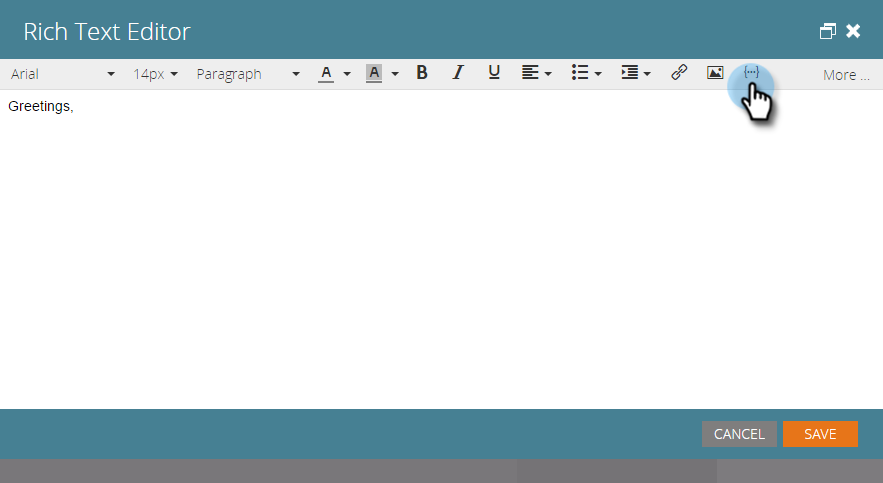

# Adicionar texto e tokens a uma página de aterrissagem {#add-text-and-tokens-to-a-landing-page}

>[!NOTE]
>
>Tokens são compatíveis apenas com landing pages do Marketo.

## Adicionar rich text à página de aterrissagem {#add-rich-text-to-your-landing-page}

1. Selecione a landing page e clique em **Editar rascunho**.

   

   >[!NOTE]
   >
   >O designer da landing page é aberto em uma nova janela.

1. Arraste para o **Texto formatado** elemento.

   

1. Insira o texto desejado e clique em **Salvar**.

   

Agora que você sabe como adicionar texto a uma landing page, vamos trabalhar para adicionar um token.

## Adicionar um token à sua página de aterrissagem {#add-a-token-to-your-landing-page}

Tokens são bits dinâmicos de texto que podem personalizar sua landing page.

>[!TIP]
>
>Coisas como Nome vêm do registro de pessoa. Outros tokens vêm da guia Meus tokens do programa.

1. Selecione a landing page e clique em **Editar rascunho**.

   

   >[!NOTE]
   >
   >O designer da landing page é aberto em uma nova janela.

1. Clique duas vezes na caixa de rich text à qual deseja adicionar o token.

   

1. Clique no ícone Inserir token.

   

1. Encontre e selecione o token de sua escolha.

   

1. Insira um **Valor padrão** e clique em **Inserir**.

   

1. Clique em **Salvar**.

   

   Missão Concluída! Agora você tem um token em sua landing page.
