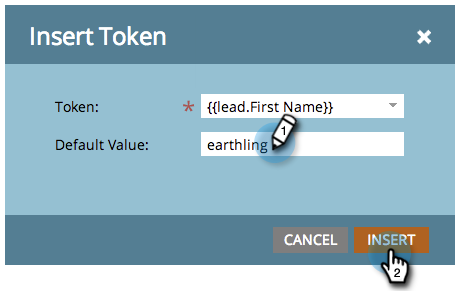

# Adicionar texto e tokens a uma página inicial {#add-text-and-tokens-to-a-landing-page}

>[!NOTE]
>
>Os tokens só são suportados em páginas de aterrissagem do Marketo.

## Adicionar Rich Text à Landing Page {#add-rich-text-to-your-landing-page}

1. Selecione sua página de aterrissagem e clique em **[!UICONTROL Editar rascunho]**.

   

   >[!NOTE]
   >
   >O designer da landing page é aberto em uma nova janela.

1. Arraste sobre o elemento **[!UICONTROL Rich Text]**.

   

1. Insira o texto desejado e clique em **[!UICONTROL Salvar]**.

   

Agora que você sabe como adicionar texto a uma página de aterrissagem, vamos trabalhar na adição de um token.

## Adicionar um token à página de aterrissagem {#add-a-token-to-your-landing-page}

Os tokens são textos dinâmicos que podem personalizar a página de aterrissagem.

>[!TIP]
>
>Coisas como Nome vem do registro de pessoa. Outros tokens vêm da guia Meus tokens no programa.

1. Selecione sua página de aterrissagem e clique em **[!UICONTROL Editar rascunho]**.

   

   >[!NOTE]
   >
   >O designer da landing page é aberto em uma nova janela.

1. Clique duas vezes na caixa de rich text à qual deseja adicionar o token.

   

1. Clique no ícone Inserir token.

   

1. Localize e selecione o token de sua escolha.

   

1. Insira um **[!UICONTROL Valor padrão]** e clique em **[!UICONTROL Inserir]**.

   

1. Clique em **[!UICONTROL Salvar]**.

   

   Missão concluída! Agora você tem um token na sua landing page.
