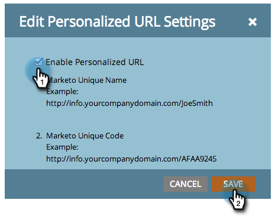

# Habilitar URLs personalizados para uma Landing page {#enable-personalized-urls-for-a-landing-page}

URLs personalizados são ótimos para campanhas de e-mail de impressão.

>[!PREREQUISITES]
>
>[Habilitar URLs personalizados para sua conta](/help/marketo/product-docs/demand-generation/landing-pages/personalizing-landing-pages/enable-personalized-urls-for-your-account.md)

1. Selecione uma landing page e clique nas configurações para **URL personalizado**.

   

1. Agora você pode marcar **Ativar URLs personalizados** e clicar em **Salvar**.

   

Ótimo! Agora você habilitou URLs personalizados para sua landing page. Os visitantes que usam esse URL serão reconhecidos e os tokens funcionarão corretamente.
