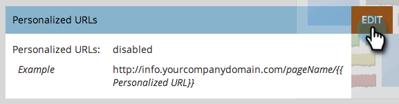
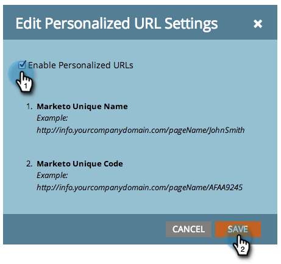

# Habilitar URLs personalizados para sua conta {#enable-personalized-urls-for-your-account}

URLs personalizados funcionam bem para campanhas de email impressas.

>[!NOTE]
>
>**Permissões de administrador são necessárias**

1. Vá para a seção **[!UICONTROL Admin]** e clique em **[!UICONTROL Páginas de Aterrissagem]**.

   

1. Clique em **[!UICONTROL Editar]**.

   

1. Marque a caixa **[!UICONTROL Habilitar URLs personalizados]** e clique em **[!UICONTROL Salvar]**.

   

Você ativou os PURLs da sua conta. Agora você pode ativá-los para páginas de aterrissagem individuais.

>[!NOTE]
>
>Se duas pessoas tiverem o mesmo nome e/ou sobrenome, o sistema anexará automaticamente um número ao final de seu nome PURL.
>
>Exemplo:
>
>1. AnnaJones
>1. AnnaJones2Name
>1. AnnaJones3Name
