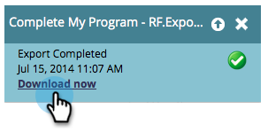

# Exportar uma lista com URLs personalizados {#export-a-list-with-personalized-urls}

>[!PREREQUISITES]
>
>* [Habilitar URLs personalizados para sua conta](/help/marketo/product-docs/demand-generation/landing-pages/personalizing-landing-pages/enable-personalized-urls-for-your-account.md)
>* [Habilitar URLs personalizadas para uma Página de Aterrissagem](/help/marketo/product-docs/demand-generation/landing-pages/personalizing-landing-pages/enable-personalized-urls-for-a-landing-page.md)

1. Selecione sua lista ou lista inteligente, clique na guia **[!UICONTROL Clientes Potenciais]** para obter os resultados e clique no ícone do Excel. INLINE Verifique se você tem **[!UICONTROL Código exclusivo do Marketo]** e **[!UICONTROL Nome exclusivo do Marketo]** [colunas visíveis](/help/marketo/product-docs/core-marketo-concepts/smart-lists-and-static-lists/using-smart-lists/create-and-change-views-for-lists-and-smart-list.md).

   

1. Marque **[!UICONTROL Incluir URL personalizada]**, localize e selecione a página de aterrissagem para a qual deseja gerar PURLs.

   

1. Selecione a **URL**.

   

   >[!TIP]
   >
   >Se você vir vários URLs para a mesma página de aterrissagem, é provável que tenha alterado o URL das páginas em algum ponto no passado e criado um redirecionamento.

1. Escolha um **[!UICONTROL Estilo]** e clique em **[!UICONTROL Exportar]**.

   

1. Quando a exportação for concluída, clique no link **[!UICONTROL Baixar Agora]** para salvar o arquivo.

   

   E pronto! Agora você tem uma lista de clientes potenciais e URLs personalizados.

   

   >[!NOTE]
   >
   >Se houver leads com o mesmo nome e sobrenome, os números serão anexados automaticamente para garantir que os URLs permaneçam exclusivos.
