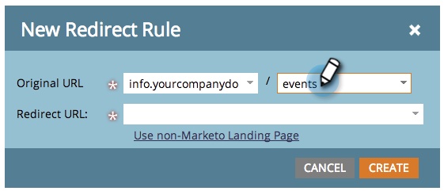

# Redirecionar um caminho de URL {#redirect-a-url-path}

O Marketo facilita o redirecionamento de um caminho de URL para qualquer página que você escolher. Veja como.

>[!NOTE]
>
>**Permissões de administrador são necessárias**

1. Em **[!UICONTROL Admin]**, clique em **[!UICONTROL Páginas de Aterrissagem]**.

   

1. Clique na guia **[!UICONTROL Regras]** e em **[!UICONTROL Nova]** e **[!UICONTROL Nova Regra de Redirecionamento]**.

   

1. Clique no primeiro menu suspenso **[!UICONTROL URL Original]** e selecione seu CNAME do Marketo.

   

   >[!NOTE]
   >
   >Lembre-se, você só pode redirecionar URLs que comecem com seu [CNAME](/help/marketo/product-docs/demand-generation/landing-pages/landing-page-actions/customize-your-landing-page-urls-with-a-cname.md) do Marketo.

1. Digite o caminho da URL (ou página específica) que você deseja redirecionar no segundo campo **[!UICONTROL URL Original]** à direita.

   

1. Clique em **[!UICONTROL Usar página de aterrissagem que não seja da Marketo]**, digite a página para a qual você deseja redirecionar visitantes no campo **[!UICONTROL Redirecionar URL]** e clique em **[!UICONTROL Criar]**.

   

   Você também pode [usar as páginas de aterrissagem do Marketo](/help/marketo/product-docs/demand-generation/landing-pages/landing-page-actions/redirect-a-marketo-landing-page-to-another-page.md) como destino.

Parabéns! Você redirecionou com êxito seu caminho de URL.

>[!MORELIKETHIS]
>
>[Redirecionar uma página de aterrissagem do Marketo para outra página](/help/marketo/product-docs/demand-generation/landing-pages/landing-page-actions/redirect-a-marketo-landing-page-to-another-page.md)
