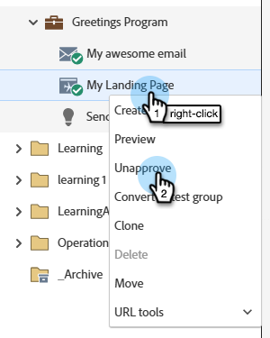

# Aprovar, cancelar aprovação de ou excluir uma página de destino {#approve-unapprove-or-delete-a-landing-page}

As landing pages estarão no modo de rascunho até que você as aprove. A aprovação disponibiliza páginas no restante do sistema. Quando você edita uma Landing page aprovada, o Marketo Engage salva o rascunho, mas continua a usar a versão aprovada até que você aprove o rascunho.

## Aprovar uma landing page {#approve-a-landing-page}

1. Selecione a Landing page desejada, clique em e em **[!UICONTROL Aprovar rascunho]**.

   

   >[!TIP]
   >
   >Você pode [aprovar várias páginas de uma só vez](/help/marketo/product-docs/demand-generation/landing-pages/landing-page-actions/approve-multiple-landing-pages-at-once.md), se desejar.

Você também pode clicar com o botão direito do mouse em sua Landing Page na navegação à esquerda e selecionar **[!UICONTROL Aprovar]**.

>[!NOTE]
>
>Uma landing page aprovada tem uma marca de seleção verde adicionada.

## Cancelar aprovação de uma landing page {#unapprove-a-landing-page}

1. Selecione a Landing page desejada e clique em **[!UICONTROL Cancelar aprovação]**.

   

Você também pode clicar com o botão direito do mouse na sua página de aterrissagem na navegação à esquerda e selecionar **[!UICONTROL Cancelar aprovação]**.

>[!NOTE]
>
>Sua landing page não aprovada não está mais publicada na Web e não gerará nenhuma atividade adicional. Os visitantes que acessarem Páginas de Aterrissagem não aprovadas e suas Guias do Facebook verão a [Página de Fallback](/help/marketo/product-docs/administration/settings/set-a-fallback-page.md).

## Excluir uma landing page {#delete-a-landing-page}

1. Selecione a landing page desejada. Clique no menu suspenso **[!UICONTROL Ações da página de aterrissagem]** e selecione **[!UICONTROL Excluir]**.

   

   >[!IMPORTANT]
   >
   >Não é possível excluir uma landing page aprovada. Você deve cancelar a aprovação primeiro.

Você também pode clicar com o botão direito do mouse em sua Landing Page na navegação à esquerda e selecionar **[!UICONTROL Excluir]**.

## Excluir várias páginas de aterrissagem {#delete-multiple-landing-pages}

1. Na tela principal do [!UICONTROL Design Studio], clique em **[!UICONTROL Páginas de Aterrissagem]**.

   

1. Selecione as Landing Pages desejadas. Clique no menu suspenso **[!UICONTROL Ações da página de aterrissagem]** e selecione **[!UICONTROL Excluir]**.

   

1. Clique em **[!UICONTROL Excluir]** para confirmar.

   
