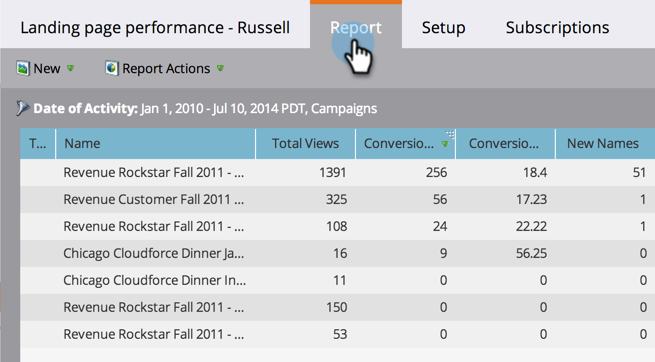

# Relatório de desempenho da página de destino {#landing-page-performance-report}

Veja quantas pessoas preencheram os formulários em suas páginas de aterrissagem e quantas delas eram novas.

>[!NOTE]
>
>Se você observar uma discrepância nos números entre o Relatório de desempenho da lista inteligente e da página de aterrissagem, é provável que as listas inteligentes filtrem apenas os dados das pessoas, enquanto os Relatórios de desempenho da página de aterrissagem incluem dados sociais (Facebook, Google Ads etc.) e anônimas, além dos dados de Pessoas.

1. [Crie um relatório](/help/marketo/product-docs/reporting/basic-reporting/creating-reports/create-a-report-in-a-program.md) e selecione o [!UICONTROL Tipo de relatório[Desempenho da página de aterrissagem]](/help/marketo/product-docs/reporting/basic-reporting/report-types/report-type-overview.md).
1. [Defina o período do seu relatório](/help/marketo/product-docs/reporting/basic-reporting/editing-reports/change-a-report-time-frame.md) e clique na guia [!UICONTROL Relatório].
1. Explore o relatório para avaliar o desempenho de suas landing pages.

   

   Entre as colunas em um relatório de desempenho de página de aterrissagem, Conversões e % de conversão refletem o número de vezes que alguém preencheu um formulário.

   >[!TIP]
   >
   >Encontre as páginas com o maior percentual de conversão! [Classifique seu relatório](/help/marketo/product-docs/reporting/basic-reporting/editing-reports/sort-report-on-columns.md) nessa coluna e escolha Classificar em ordem decrescente.

   O ícone AB no relatório indica que as estatísticas são o total de todas as páginas no [grupo de teste de landing page](/help/marketo/product-docs/demand-generation/landing-pages/understanding-landing-pages/landing-page-test-groups.md).

1. Role para a direita para ver o número de visitas originadas em várias plataformas de redes sociais.

   

>[!MORELIKETHIS]
>
>[Filtre o relatório de desempenho da página de aterrissagem](/help/marketo/product-docs/demand-generation/landing-pages/landing-page-actions/filter-a-landing-page-performance-report.md) por ativos locais ou globais.
