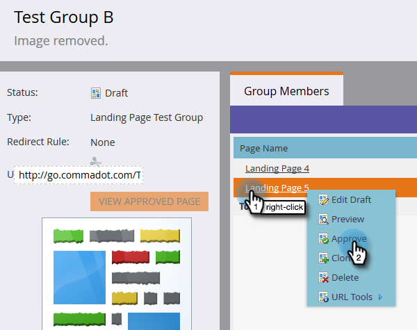
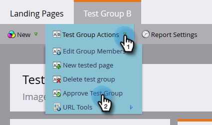
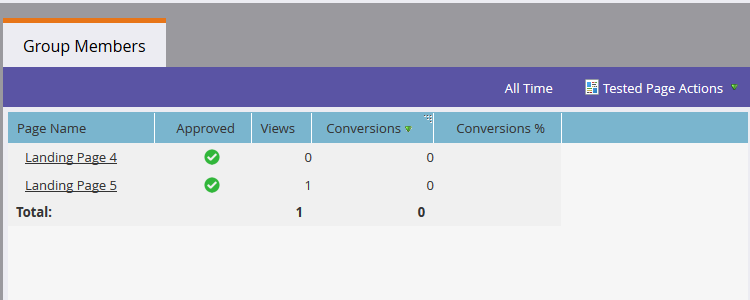

# Grupos de teste de páginas de destino {#landing-page-test-groups}

O Marketo rastreia o número de exibições de página e conclusões de formulário em cada página testada em um Grupo de teste. Você pode usar os resultados do grupo de teste para decidir qual página de aterrissagem é a mais atraente. Veja como criar um grupo de teste.

>[!PREREQUISITES]
>
>[Crie duas ou mais páginas de aterrissagem](/help/marketo/getting-started/quick-wins/landing-page-with-a-form.md), de preferência com um formulário.

1. No Design Studio, clique em **[!UICONTROL Novo]**. Na lista suspensa, selecione **[!UICONTROL Novo Grupo de Teste]**.

   

   >[!NOTE]
   >
   >As outras maneiras de criar um Grupo de teste são:
   >
   >* Clique com o botão direito do mouse em uma página de aterrissagem na árvore e selecione **[!UICONTROL Converter em Grupo de Teste]**
   >* Crie um Grupo de Teste de Página de Aterrissagem em um programa escolhendo **[!UICONTROL Grupo de Teste AB]** no menu **[!UICONTROL Novo Ativo Local]**

1. Insira um nome e uma descrição opcional. Selecione as Landing Pages que deseja testar e clique em **[!UICONTROL Criar]**.

   

   >[!NOTE]
   >
   >Somente as Landing Pages não aprovadas estarão disponíveis para escolha.

1. Clique com o botão direito do mouse em cada Landing Page e selecione **[!UICONTROL Aprovar]**.

   

1. Clique na lista suspensa **[!UICONTROL Ações do Grupo de Teste]** e selecione **[!UICONTROL Aprovar Grupo de Teste]**.

   

   Pronto! Agora é possível comparar as estatísticas das Páginas de aterrissagem selecionadas.

   

   >[!TIP]
   >
   >Se quiser excluir o Grupo de Teste, basta clicar em **[!UICONTROL Ações de Grupo de Teste]** e selecionar **[!UICONTROL Excluir grupo de teste]**.
