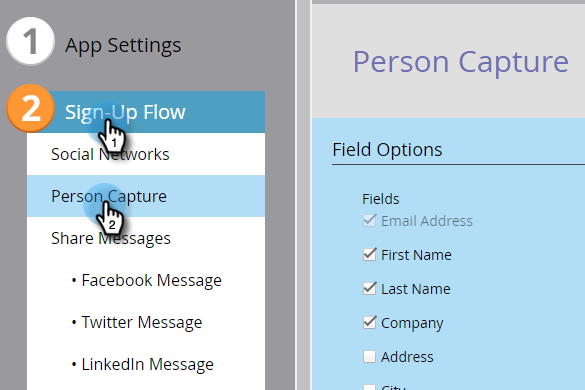

# Configurar a captura de pessoas para um aplicativo social {#configure-person-capture-for-a-social-app}

Ao criar uma [oferta de referência](/help/marketo/product-docs/demand-generation/social/referral-offers/create-a-referral-offer.md) ou um [sorteio](/help/marketo/product-docs/demand-generation/social/sweepstakes/create-sweepstakes.md), você pode configurar quais informações você solicita e quais informações são necessárias para que as pessoas possam participar.

>[!IMPORTANT]
>
>Em 31 de julho de 2024, iniciamos o processo de desativação desse recurso. Você não poderá criar novos ativos. Os ativos existentes continuarão a funcionar até 31 de janeiro de 2025. [Saiba mais](https://nation.marketo.com/t5/employee-blogs/marketo-engage-social-features-deprecation/ba-p/351977){target="_blank"}

>[!NOTE]
>
>As pessoas só serão solicitadas a fornecer essas informações se elas não tiverem sido fornecidas anteriormente.

1. Vá para **Atividades de marketing**.

   

1. Selecione o aplicativo e clique em **Editar rascunho**.

   

1. No editor de aplicativo social, vá para **Fluxo de inscrição** > **Captura de pessoa**.

   

1. Selecione as informações que você vai solicitar e indique os campos que são especificamente necessários para se inscrever para a sua oferta.

   

   Incluir opções de marketing:

   * **Recusar**: a pessoa é inscrita por padrão.
   * **Aceitar**: a pessoa pode optar por assinar.

   >[!NOTE]
   >
   >De qualquer forma, os participantes ainda receberão os [_emails_ operacionais](/help/marketo/product-docs/email-marketing/general/functions-in-the-editor/make-an-email-operational.md) da sua oferta.

1. Na janela Exibir e editar, clique em **Mostrar edições** e edite as mensagens no prompt de compartilhamento.

   

>[!MORELIKETHIS]
>
>Agora você pode [configurar o fluxo de inscrição social](/help/marketo/product-docs/demand-generation/social/configuring-social-actions/configure-social-sign-up-share-flow.md) e editar as mensagens compartilhadas que serão postadas em cada rede social.
