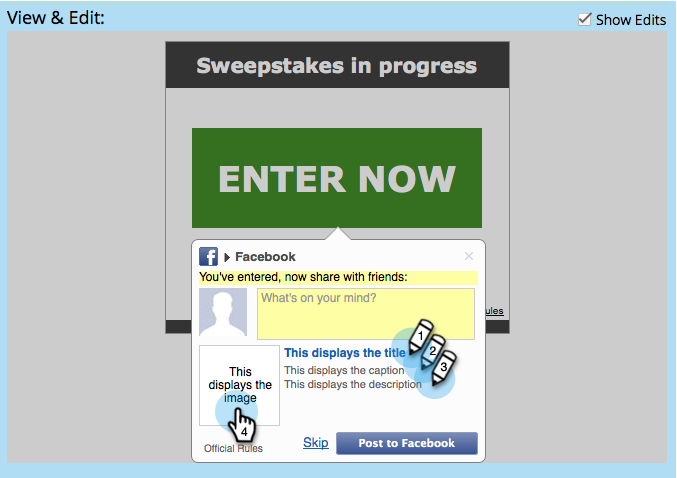

# Configurar O Fluxo De Inscrição/Compartilhamento Social {#configure-social-sign-up-share-flow}

Ao criar um aplicativo social, você pode configurar as opções de rede social e os prompts que um usuário encontra ao se inscrever.

>[!IMPORTANT]
>
>Em 31 de julho de 2024, iniciamos o processo de desativação desse recurso. Você não poderá criar novos ativos. Os ativos existentes continuarão a funcionar até 31 de janeiro de 2025. [Saiba mais](https://nation.marketo.com/t5/employee-blogs/marketo-engage-social-features-deprecation/ba-p/351977){target="_blank"}

## Selecionar redes para compartilhamento {#select-networks-for-sharing}

1. Vá para **Atividades de marketing**.

   

1. Selecione o aplicativo e clique em **Editar rascunho**.

   

1. No editor de aplicativo social, clique em **Fluxo de inscrição** > **Redes sociais**.

   

1. Selecione (ou desmarque) as redes para as quais uma pessoa pode compartilhar.

   

## Configurar a mensagem do Facebook {#configure-the-facebook-message}

1. Vá para **Fluxo de Inscrição** > **Compartilhar Mensagens**.

   

1. Configure a mensagem que aparecerá nas publicações do Facebook.

   

   >[!NOTE]
   >
   >Em um compartilhamento de vídeo, a miniatura é gerada automaticamente.

   If you choose **Add Dynamic content**, the values of the page&#39;s **OpenGraph** tags (og:title, og:caption, and og:description) and the thumbnail are automatically added to Facebook posts. Consulte a próxima etapa.

   Se você escolher **Adicionar conteúdo estático**, insira o título, a legenda, a descrição e carregue uma imagem. Consulte as próximas duas etapas.

1. Na janela Exibir e editar, clique em **Mostrar edições** e edite o prompt de compartilhamento e a mensagem que aparecerão nas publicações do Facebook.

   >[!TIP]
   >
   >Para obter mais informações, consulte [Editar configurações de postagem avançada do Facebook](/help/marketo/product-docs/demand-generation/facebook/edit-facebook-rich-post-settings.md).

   

   >[!NOTE]
   >
   >A [URL de compartilhamento](/help/marketo/product-docs/demand-generation/social/social-functions/choose-the-share-url-for-a-social-app.md) é adicionada automaticamente a todas as mensagens de compartilhamento.

1. Se você escolheu **Adicionar conteúdo estático** acima, edite o título, a legenda e a descrição e carregue uma imagem personalizada (a partir de suas [**Imagens e Arquivos do Marketo**](/help/marketo/product-docs/demand-generation/images-and-files/add-images-and-files-to-marketo.md)).

   

   Consulte [Adicionar imagens e arquivos ao Marketo](/help/marketo/product-docs/demand-generation/images-and-files/add-images-and-files-to-marketo.md).

   >[!NOTE]
   >
   >Ao carregar uma imagem, você não a verá aqui até fechar e reabrir o editor do aplicativo social.

1. Clique em **Avançar**.

If you choose the values of the page&#39;s tags (og:title, og:caption, and og:description) and the thumbnail are automatically added to Facebook posts. Consulte a próxima etapa.

## Configurar a mensagem de Twitter {#configure-the-twitter-message}

1. Edite o prompt de compartilhamento e a mensagem que aparecerá nos tweets de Twitter.

   

   >[!TIP]
   >
   >Use {html_title} no texto do tweet para exibir o título da página automaticamente.

1. Clique em **Avançar**.

## Configurar a mensagem do LinkedIn {#configure-the-linkedin-message}

1. Configure a mensagem que aparecerá nas publicações do LinkedIn.

   

   Se você escolher **Adicionar conteúdo dinâmico**, os valores das marcas de página (título e descrição) e a miniatura serão adicionados automaticamente às postagens do LinkedIn. Consulte a próxima etapa.

   Se você escolher **Adicionar conteúdo estático**, insira o título, a legenda e a descrição e carregue uma imagem. Consulte as próximas duas etapas.

1. Na janela **Exibir e editar**, clique em **Mostrar edições** e edite o prompt de compartilhamento e a mensagem que aparecerão nas publicações do LinkedIn.

   

   >[!TIP]
   >
   >Use {html_title} no texto da postagem para exibir o título da página automaticamente.

1. Se você escolheu **Adicionar conteúdo estático** acima, edite o título e a descrição e carregue uma imagem personalizada (a partir de suas [**Imagens e arquivos do Marketo**](/help/marketo/product-docs/demand-generation/images-and-files/add-images-and-files-to-marketo.md)).

   

>[!NOTE]
>
>Ao carregar uma imagem, você não a verá aqui até fechar e reabrir o editor do aplicativo social.

>[!MORELIKETHIS]
>
>Em seguida, você pode clicar em **Concluir** > **Aprovar e Fechar** e colocar seu aplicativo social em uma página de aterrissagem. Você também pode configurar a [captura de pessoa](/help/marketo/product-docs/demand-generation/social/configuring-social-actions/configure-person-capture-for-a-social-app.md) ou o [prompt de recompartilhamento](/help/marketo/product-docs/demand-generation/social/configuring-social-actions/configure-re-share-email-and-prompt-for-a-social-app.md).
