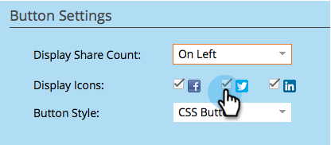

# Botão Personalizar aplicativo social {#customize-social-app-button}

Ao criar um [botão de redes sociais](/help/marketo/product-docs/demand-generation/landing-pages/free-form-landing-pages/add-a-social-button-to-a-free-form-landing-page.md) ou uma [oferta de referência](/help/marketo/product-docs/demand-generation/social/referral-offers/create-a-referral-offer.md), você pode personalizar a aparência dos botões.

>[!IMPORTANT]
>
>Em 31 de julho de 2024, iniciamos o processo de desativação desse recurso. Não é mais possível criar novos ativos. Os ativos existentes continuarão a funcionar até 31 de janeiro de 2025. [Saiba mais](https://nation.marketo.com/t5/employee-blogs/marketo-engage-social-features-deprecation/ba-p/351977){target="_blank"}

1. Vá para **Atividades de marketing**.

   

1. Selecione o aplicativo e clique em **Editar rascunho**.

   

1. No editor de aplicativos sociais, vá para **Configurações do Aplicativo** > **Estilo do Botão** (ou **Estilo de Inscrição** para ofertas de referência).

   

1. Escolha onde exibir ou não a contagem de compartilhamento.

   

1. Selecione quais ícones de rede social serão exibidos com os botões correspondentes.

   

   >[!NOTE]
   >
   >Para ofertas de referência, selecione suas redes em **2. Fluxo de Inscrição > Redes Sociais**.

1. Escolha um tipo de botão.

   

   >[!TIP]
   >
   >Se você escolheu **Carregar imagens no estilo de botão** acima, as seções a seguir permitem carregar imagens de botão em vez de editar o texto.

1. Edite os rótulos do botão antes e depois de ser clicado.

   

1. Conforme você faz cada escolha, revise o resultado na janela **Exibir e editar**.

   

>[!NOTE]
>
>Em uma oferta de referência, você também pode personalizar o botão **Rastrear progresso**. Vá para **Configurações do Aplicativo** > **Estilo de Progresso de Rastreamento** e siga as mesmas etapas descritas acima.

>[!MORELIKETHIS]
>
>Para um botão social, [configure quando ele for aberto](/help/marketo/product-docs/demand-generation/social/configuring-social-actions/configure-when-social-button-opens.md). Para uma oferta de referência, [especifique a meta da oferta](/help/marketo/product-docs/demand-generation/social/referral-offers/specify-goal-for-referral-offer.md).
