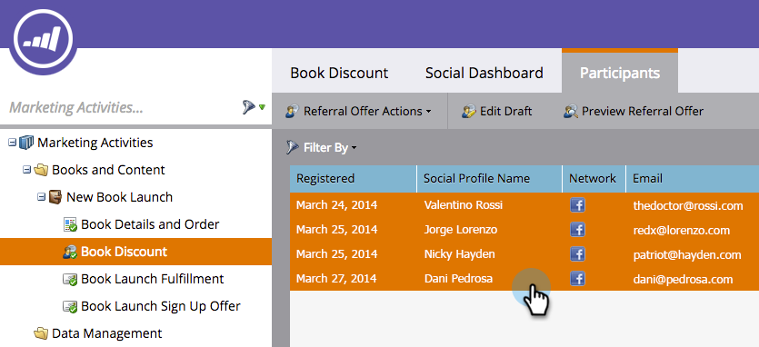

# Enviar email de preenchimento de oferta de referência {#send-referral-offer-fulfillment-email}

Recompense seus clientes com cupons e códigos de desconto usando o email de preenchimento da oferta.

>[!IMPORTANT]
>
>Em 31 de julho de 2024, iniciamos o processo de desativação desse recurso. Não é mais possível criar novos ativos. Os ativos existentes continuarão a funcionar até 31 de janeiro de 2025. [Saiba mais](https://nation.marketo.com/t5/employee-blogs/marketo-engage-social-features-deprecation/ba-p/351977){target="_blank"}

>[!PREREQUISITES]
>
>* [Usar emails em promoções sociais](/help/marketo/product-docs/demand-generation/social/social-functions/use-emails-in-social-promotions.md)
>* [Criar uma Oferta de Indicação](/help/marketo/product-docs/demand-generation/social/referral-offers/create-a-referral-offer.md)

## Configurar Entrega de Abastecimento {#set-up-fulfillment-delivery}

1. Selecione a oferta de referência. Clique em **Editar rascunho**.

   

1. Em **Configurações do aplicativo**, selecione **Detalhes da oferta**.

   

1. Selecione um **Email de inscrição**.

   

1. Selecione um **Email de Abastecimento**.

   

   >[!NOTE]
   >
   >Saiba mais sobre [como usar emails em promoções sociais](/help/marketo/product-docs/demand-generation/social/social-functions/use-emails-in-social-promotions.md).

1. Clique na lista suspensa **Entrega de Abastecimento** e selecione **automático na meta**.

   

   A mensagem selecionada em **Email de Abastecimento** será enviada automaticamente para as pessoas que atingirem a meta.

## Envio manual {#manual-send}

Você pode enviar um email de preenchimento manualmente para uma pessoa depois que ela atingir a meta.

1. Selecione a oferta de referência e clique na guia **Participantes**.

   

1. Clique na opção **Filtrar por** e selecione **Meta**.

   >[!NOTE]
   >
   >Seleciona as pessoas que atingiram a meta de oferta de referência.

   

1. Selecione as pessoas na exibição filtrada.

   

1. Clique com o botão direito do mouse e selecione **Enviar Email de Abastecimento**.

   

Fantástico! Essas pessoas agora receberão o email de cumprimento e ficarão entusiasmadas com sua recompensa.
