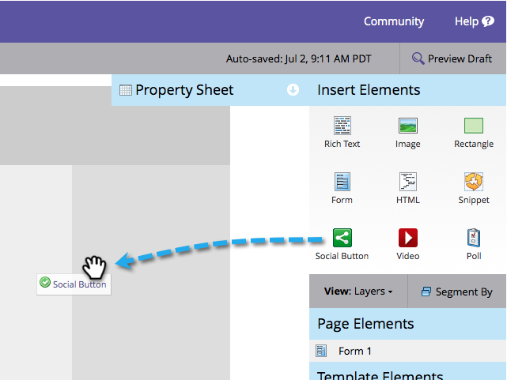

# Adicionar um botão do Social em uma página de aterrissagem {#add-a-social-button-on-a-landing-page}

Um botão social incentiva as pessoas a compartilharem seu conteúdo com os amigos. Solte-o nas landing pages, no Facebook e no seu site.

>[!IMPORTANT]
>
>Em 31 de julho de 2024, iniciamos o processo de desativação desse recurso. Você não poderá criar novos ativos. Os ativos existentes continuarão a funcionar até 31 de janeiro de 2025. [Saiba mais](https://nation.marketo.com/t5/employee-blogs/marketo-engage-social-features-deprecation/ba-p/351977){target="_blank"}

>[!AVAILABILITY]
>
>Nem todos os usuários do Marketo Engage compraram essa funcionalidade. Entre em contato com a equipe de conta do Adobe (seu gerente de conta) para obter mais detalhes.

1. Navegue até a página de aterrissagem e clique em **Editar rascunho**.

   

1. Arraste sobre o **Botão Social** dos elementos à direita.

   

1. Selecione **Botões sociais (com o Analytics)**.

   

   Quando a página de aterrissagem estiver ativa, consulte a atividade gerada pelo seu **Botão Social** (com o Analytics) no [Painel Social](/help/marketo/product-docs/demand-generation/social/social-functions/view-social-performance.md).

   Se você adicionar um **Botão Curtir/Recomendar (Lite)**, veja o número de compartilhamentos no [relatório de desempenho da página de aterrissagem](/help/marketo/product-docs/demand-generation/landing-pages/understanding-landing-pages/landing-page-performance-report.md).

1. Selecione **Criar novo** no menu suspenso.

   >[!NOTE]
   >
   >Você também pode criar um botão social dentro de um programa selecionando **Novo** > **Novo ativo local**.

1. Nomeie seu botão de redes sociais, selecione **Nenhum** de **Clonar** **De** e clique em **Inserir**.

   

Parabéns! Você adicionou um botão de rede social à página de aterrissagem. Certifique-se de aprovar a landing page. Você também pode [publicar a página de aterrissagem no Facebook](/help/marketo/product-docs/demand-generation/facebook/publish-landing-pages-to-facebook.md) ou [colocar o botão social no seu site](/help/marketo/product-docs/demand-generation/social/social-functions/deploy-social-on-your-website.md).

>[!TIP]
>
>Para economizar tempo, você pode usar a opção **Clonar de** para copiar todas as configurações de um botão de rede social existente.

>[!MORELIKETHIS]
>
>Você concluiu, mas pode alterar as configurações do botão de redes sociais, se necessário. Comece com [personalizando o estilo de botão](/help/marketo/product-docs/demand-generation/social/configuring-social-actions/customize-social-app-button.md) e [editando as mensagens compartilhadas](/help/marketo/product-docs/demand-generation/social/configuring-social-actions/configure-social-sign-up-share-flow.md) que ele apresenta.
