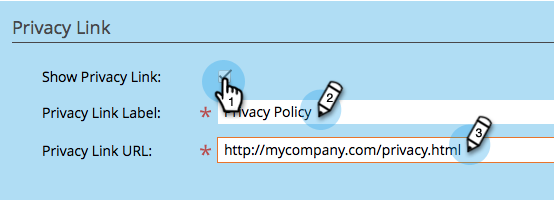

# Adicionar sua política de privacidade a um aplicativo social {#add-your-privacy-policy-to-a-social-app}

Ao criar um aplicativo social, você pode adicionar um link para a política de privacidade da sua empresa.

1. Vá para **Atividades de marketing**.

   

1. Selecione o aplicativo e clique em **Editar rascunho**.

   

1. No editor de aplicativos sociais, vá para **Configurações do Aplicativo** > **Opções Avançadas**.

   

1. Para adicionar um link à sua política de privacidade, marque a caixa de seleção, edite o título e insira o URL.

   

   >[!NOTE]
   >
   >Nessa tela, você também pode adicionar um link para as regras (termos e condições) da sua oferta. Consulte [Criar uma Oferta de Indicação](/help/marketo/product-docs/demand-generation/social/referral-offers/create-a-referral-offer.md).

1. O link da política de privacidade (e o link de regras) aparecerá na parte inferior das telas de mensagem de compartilhamento. Por exemplo:

   

Em seguida, você pode [configurar a inscrição social e o fluxo de compartilhamento](/help/marketo/product-docs/demand-generation/social/configuring-social-actions/configure-social-recommend-flow.md) do seu aplicativo.
