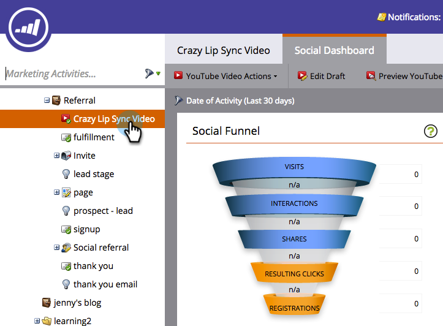
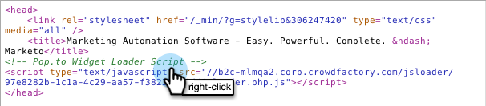

# Implantar Social no seu site {#deploy-social-on-your-website}

Incorpore aplicativos sociais em suas páginas que não são do Marketo.

>[!IMPORTANT]
>
>Em 31 de julho de 2024, começamos o processo de descontinuação desse recurso. Você não poderá criar novas ativos. A ativos continuará a funcionar até 31 de janeiro de 2025. [Saiba mais](https://nation.marketo.com/t5/employee-blogs/marketo-engage-social-features-deprecation/ba-p/351977){target="_blank"}

>[!AVAILABILITY]
>
>Nem todos os Marketo Engage usuários compraram esse funcionalidade. Entre em contato com a equipe de conta do Adobe Systems (seu gerente de conta) para obter detalhes.

Você pode implantar aplicativos sociais em seu próprio site para envolver seus público-alvo e trazer todos para a conversa maior nas redes sociais. À medida que as pessoas compartilham suas promoções e conteúdo com seus amigos nas redes sociais, você gera mais tráfego no seu site.

1. Selecione um aplicativo social aprovado, como um Vídeo do YouTube ou um Botão Social.

   

1. Selecione **Incorporar Code** em ações do Social aplicativo.

   

1. Copie o código para o cabeçalho (`<head>`) e corpo do página do seu site.`<body>`

   

1. Colar o primeiro snippet de código no cabeçalho de página do seu site.

   

1. Colar o segundo snippet de código em cada página, em que você deseja que seu aplicativo social apareça no página.

   

1. Se for necessário definir o tamanho do aplicativo social para dimensões específicas no página, adicione as **opções outerHeight** e **outerWidth** ao segundo trecho de código. Por exemplo, você pode adicionar `options='{"outerHeight":400, "outerWidth":600}'`, como em:

   

   Seu aplicativo social do Marketo agora adiciona conteúdo e interatividade ao seu site, convidando fãs, visitantes e clientes existentes a espalharem a notícia sobre você. Ao mesmo tempo, ele adiciona seus dados de perfil ao seu banco de dados e rastreia métricas de influência social.

   >[!MORELIKETHIS]
   >
   >* [Botão Personalizar Social aplicativo](/help/marketo/product-docs/demand-generation/social/configuring-social-actions/customize-social-app-button.md)
   >* [Definir Social requisito de compartilhamento](/help/marketo/product-docs/demand-generation/social/social-functions/set-social-share-requirement.md)
   >* [Publish Páginas de aterrissagem no Facebook](/help/marketo/product-docs/demand-generation/facebook/publish-landing-pages-to-facebook.md)
